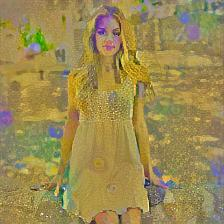

# ConvNet - Style Transfer
_Using PyTorch to apply artistic styles to pictures_

---

## About

This is my first ML-Project using the PyTorch library. Furthermore, I want to gain some experience with advanced
ConvNet technologies and wanted to have some fun with the creative parts of machine learning.

## Usage

The style-transfer script is built to work like any other command-line application. You call it using python and pass some of the following arguments to it:

| Argument          | Explanation                                                       | Required? | Default             |
|-------------------|-------------------------------------------------------------------|-----------|---------------------|
| -h, --help        | Displays the help message                                         | - [ ]     | -                   |
|                   |                                                                   |           |                     |
| -c, --content     | Specifies the location of the content-image                       | - [x]     | -                   |
| -s, --style       | Specifies the location of the style-image                         | - [x]     | -                   |
| -d, --destination | Specifies the destination of the resulting image                  | - [ ]     | -                   |
|                   |                                                                   |           |                     |
| -v, --verbose     | Flag; Should intermediate results be displayed?                   | - [ ]     | False               |
| -i, --interval    | Defines the interval in which current results should be displayed | - [ ]     | 10                  |
|                   |                                                                   |           |                     |
| --lr              | Defines the learning rate                                         | - [ ]     | 0.1                 |
| --content-w       | Provides the content weight                                       | - [ ]     | 1                   |
| --style-w         | Provides the style weight                                         | - [ ]     | 105      |
| --tv-w            | Provides the total variation weight                               | - [ ]     | 3 * 10-3 |

## Results

After a couple of bug fixes, here are some of the final results:

| Content                                                 | Style                                                                | Result                                                         |
|---------------------------------------------------------|----------------------------------------------------------------------|----------------------------------------------------------------|
|         |         |             |
|  |          |  |
|  |  |   |

_Various examples_

| ...                                                      | August Macke - "Four Girls"                                   | Gustav Klimt - "The Kiss"                         | Hiroshige - "Toyokawa Bridge"                                        | The Tarantula Nebula                                         | Vincent van Gogh - "Starry Night"                             | Edvard Munch - "The Scream"                           |
|----------------------------------------------------------|---------------------------------------------------------------|---------------------------------------------------|----------------------------------------------------------------------|--------------------------------------------------------------|---------------------------------------------------------------|-------------------------------------------------------|
|                                                          |  |  |  |  |  |  |
|  |          |    |            |   |        |      |
|    |           |     |             |    |         |       |

_Various styles applied to content images_

## Conclusion

Over all, I'm very happy with how this project turned out. Not only did I learn many new things about the PyTorch library, but I was also able to improve my skills in working with convolutional neural networks and finetuning learning processes. 

Furthermore, I'm really glad about the end results. With a different GPU, one with more memory, I'd probably be able to make the pictures look even better, as it would allow for neural style transfer with larger images.

---

... MattMoony (September, 2019)