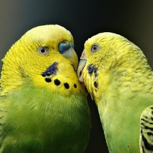
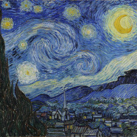
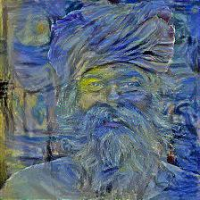

# ConvNet - Style Transfer
_Using PyTorch to apply artistic styles to pictures_

---

## About

This is my first ML-Project using the PyTorch library. Furthermore, I want to gain some experience with advanced
ConvNet technologies and wanted to have some fun with the creative parts of machine learning.

## Results

After a couple of bug fixes, here are some of the final results:

| Content                                                  | Style                                                                | Result                                                         |
|----------------------------------------------------------|----------------------------------------------------------------------|----------------------------------------------------------------|
|    |               |                  |
|          |         |             |
|  |         |           |
|   |          |  |
|   |  |          |

## Conclusion

Over all, I'm very happy with how this project turned out. Not only did I learn many new things about the PyTorch library, but I was also able to improve my skills in working with convolutional neural networks and finetuning learning processes. 

Furthermore, I'm really glad about the end results. With a different GPU, one with more memory, I'd probably be able to make the pictures look even better, as it would allow for neural style transfer with larger images.

---

... MattMoony (September, 2019)